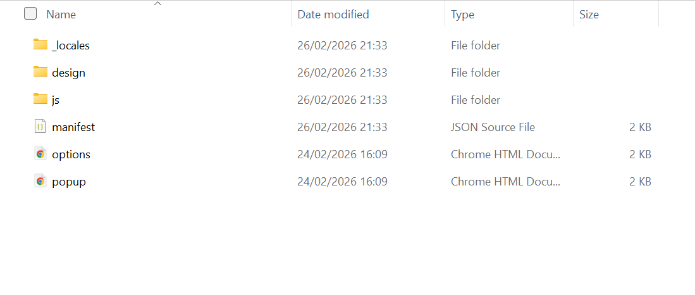
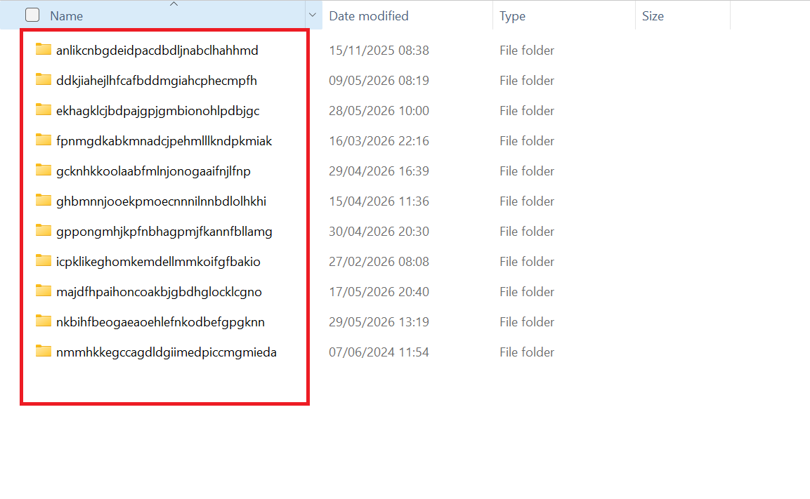
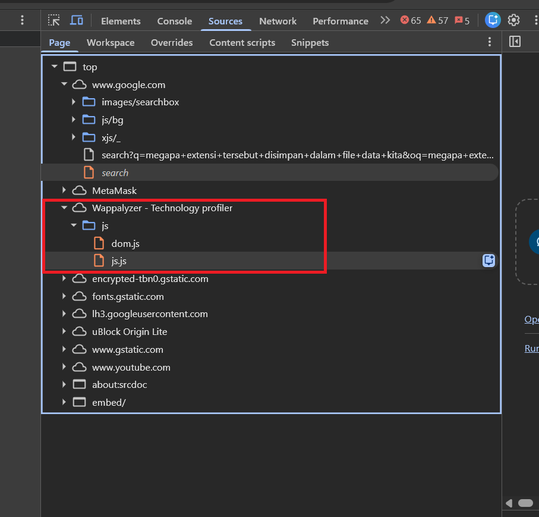

# Analisis Extensi dan Cara Kerjanya pada Mesin Pencari

###### Tanggal Riset: 30/05/2026 08:24
###### Media Uji: chrome 
---

Kali ini kita akan membahas & melakukan analisis terkait extensi yang ada pada mesin pencarian. ***meskipun media uji coba adalah chrome proses & cara kerja juga hampir sama dengan bebera mesin pencari lainnya***

**Apa itu extensi ?**

Ekstensi Chrome adalah program kecil untuk memodifikasi pengalaman atau menambahkan fungsionalitas pada browser Chrome. Ekstensi dibuat menggunakan teknologi web seperti HTML , CSS , JavaScript , dll. Tujuan utama sebuah ekstensi adalah untuk melayani satu tujuan tunggal yang menjadi dasar seluruh program

fokus utama extensi adalah untuk menyediakan fungsionalitas yang baik dengan overhead yang lebih sedikit. Ekstensi dikompres ke dalam paket format `file .crx` , pengguna perlu mengunduh paket tersebut dan menginstalnya. Ekstensi Chrome diterbitkan di Chrome Web Store. [penjelasan lengkap](https://www.geeksforgeeks.org/blogs/what-are-chrome-extensions/)

**Dimana file extensi disimpan ?**

beberapa orang mengetahui (termasuk saya sebelum membedah ini) extensi hanya tersimpan dibagian fitur mesin pencari itu secara langsung. Namun faktanya tidak !!. 

extensi tersebut disimpan dalam file data kita (file explorer - jika meggunakan PC windows ) biasanya tersimpan di folder 
```txt
AppData\Local\Google\Chrome\User Data\Default\Extensions
```
file ini tertanam sebagai mana file - file pada umumnya.Mengapa demikian ?

singkatnya ada 2 alasan logis yang saya dapatkan :
+ **Agar Tidak Mengganggu Pengguna Lain:** Komputer bisa dipakai beberapa orang dengan akun Windows berbeda. Disimpan di folder Anda artinya ekstensi itu hanya aktif di akun Anda dan tidak otomatis terpasang di akun orang lain.
+ **Biar Lancar Tanpa Izin Admin:** Jika disimpan di folder sistem (seperti Program Files), Chrome harus terus-menerus meminta izin Administrator (klik "Yes" pada Windows UAC) setiap kali Anda menginstal atau memperbarui ekstensi. Di folder data Anda `(AppData)`, Chrome bebas mengelolanya tanpa mengganggu Anda.

***Bagaimana siklus hidup extensi ?***

pada dasarnya prinsipnya hampir sama dengan kita mendownload file pada umumnya, berikut penjelasanya:
+ Di server Chrome Web Store, ekstensi disimpan dalam format file terkompresi bernama `.crx` (Chrome Extension). File `.crx` sebenarnya adalah file ZIP biasa yang dilengkapi dengan tanda tangan digital untuk memastikan kodenya asli
+ Saat Anda mengklik "Add to Chrome", browser mengunduh file `.crx` tersebut.
+ Browser otomatis mengekstrak (membongkar) isi file .crx tersebut menjadi folder-folder kode mentah (.json, .js, .html, .css) 



dan menyimpannya ke dalam jalur lokal PC Anda biasanya disimpan di:
```txt
AppData\Local\Google\Chrome\User Data\Default\Extensions\\[ID_Ekstensi]
```
perlu diketahui bahwa `ID_Extensi` merupakan beberapa huruf acak yang panjang (pada chrome), seperti ini : 
```txt
fpnmgdkabkmnadcjpehmlllkndpkmiak
```
atau seperti pada tampilan gambar ini gambar ini:


+ Begitu file selesai diekstrak ke harddisk, browser Chrome akan membaca berkas `manifest.json` (yang bisa dikatakan otak dari extensi itu sendiri)
+ Saat browser Chrome dinyalakan, browser memuat ekstensi dari harddisk ke memori RAM. begitu juga sebaliknya

+ ketika extensi di hapus sistem otomatis juga menghapus file yang ada di penyimpanan kita begitu juga ketika ada update terbaru

***apa yang dilakukan para pakar keamanan cyber dan hacker ?***

mungkin kita sebagai pengguna biasa hanya melihat ini sebagai fitur saja, namun bagi para pakar keamanan cyber hal ini menjadi sebuah hal menarik sekaligus mengerikan. 

+ disatu sisi para pakar mencari dimana celah logika yang kemunkinan bisa dimanipulasi seperti melakukan bypass logika yang secara extensi ada limit/batasan menggunakannya menjadi unlimited (tidak ada batasan) yang nantinya akan dilaporakan ke pihak terkait

+ disisi lain ini menjadi taman bermain para peretas jahat yang memanfaatkan celah keamanan untuk keuntungan pribadi dan membahayakan orang lain. seperti melakukan pembuatan extensi yang mirip namun dengan menyisipkan tunneling jaringan agar dapat membaca trafict data yang berjalan atau untuk mendistribusikan malware. mengingat semua extensi akan otomatis di extract ketika user telah menginstallnya.

**Apakah  bisa membuat extensi sendiri ?**

jawabannya ya, bisa. hal ini sebagaimana ketentuan yang tertulis di dokument ini [klik ini](https://developer.chrome.com/docs/extensions/get-started?hl=id). jika di buat list berikut langkah langkah singkatnya :
+ Siapkan Folder Kerja di PC
+ Buat Berkas `manifest.json`- sebagai otak ekstensi
+ Buat Berkas Antarmuka `popup.html` - nantinya ini akan ditampilkan ke user
+ Buat Berkas Logika Eksekusi `popup.js`
+ Memasang Ekstensi ke Browser dalam `Mode Developer` - nah kita bisa menggunakan extensi kita tampa harus menguploadnya di `Chrome Web Store`

    + Buka Google Chrome, lalu masuk ke halaman manajemen ekstensi dengan mengetik `chrome://extensions/` 
    + Aktifkan tombol `Developer mode` di pojok kanan atas hingga berubah menjadi posisi On.
    + Klik tombol `Load unpacked` yang muncul di pojok kiri atas.
    + kemudian pilih folder extensi yang sudah dibuat tadi


**Baca juga**
+ https://brave.com/learn/what-are-web-browser-extensions/
+ https://www.huntress.com/cybersecurity-101/topic/browser-extensions 
+ https://www.streak.com/post/what-is-a-browser-extension 


