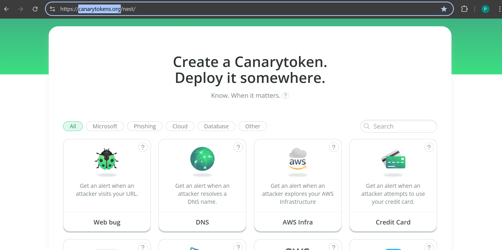
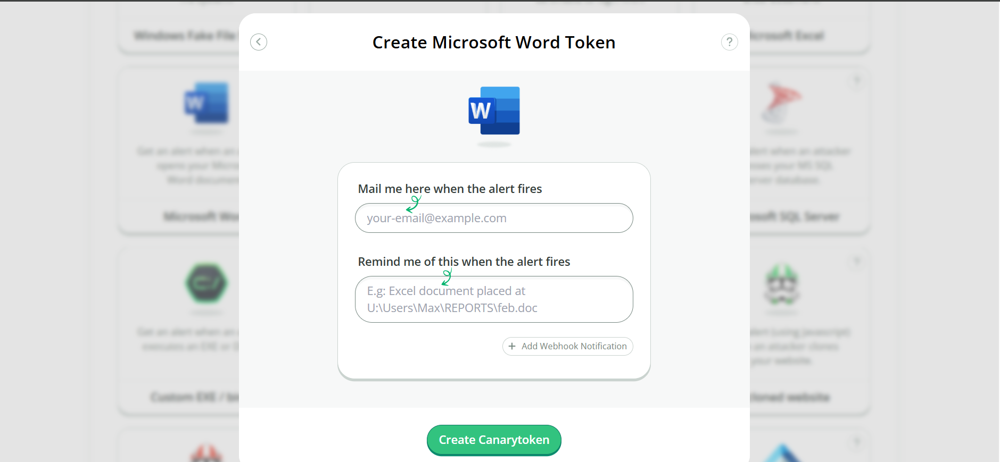
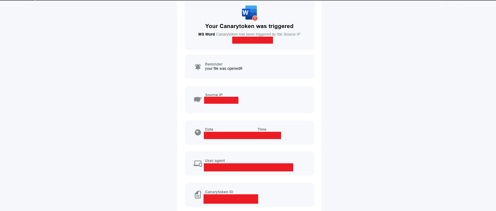

# Bongkar-Pasang-Docx-Xlsx-Pptx Dalam Konteks Meta-Data file
---
###### Tanggal Riset: 15/03/2026 23:15
###### Kategori: Digital Forensics / Anti-Forensics
###### Setup Lab & Defensif: [Panduan Penggunaan Canarytokens](../Lab-Setup/Canarytokens-Guide.md)
###### Forensic: [Tata cara analisis](../Forensics/Bongkar-Pasang-Docx-Xlsx-Pptx)


**PEMBUKAAN**
Hai semuanya kali ini saya akan memaparkan hasil dari analisis saya dalam melakukan pembongkaran file yang mengandung honey-pot dan juga membuat file berisi honey-pot dengan menggunakan "canarytokens".Rasanya sungguh aneh dan mengerikan, bagaimana tidak, kita bisa menyisipkan sesuatu yang orang awan tidak pernah tau atau sadari kedalam file yang sering kita jumpai sehari-hari, selain itu kita juga bisa melakukan deep analysis dengan menerapkan beberapa teknik untuk melakukan extrak data(meta data). berikut beberapa penjelasan dari apa yang sudah saya coba analisis sebelumnya :

**MATERI**
1. saya mulai dengan masuk ke dalam web mereka "canarytokens.org". disini terdapat banyak pilihan dan kamu bisa memilihnya dan jangan lupa untuk mensuport mereka ya !!

2. masukkan data sesuai yang diminta, email kamu nanti akan dijadikan tempat perantara untuk mengirimkan notifikasi ke kamu

3. kamu akan menerima notif dari mereka dan mendownload file tersebut
4. ketika file itu dibuka oleh seseorang mereka akan mengirimkan mu notifikasi informasi ke email mu

5. dan hasilnya berhasil... 

##### sekarang kita akan membahas secara singkat bagaimana cara saya melakukan pembongkaran dan maipulasi informasi didalam file tersebut

1. saya analisis dulu file saya atau file apapun itu dengan 
```bash
file nama_file.docx
```
2. lakukan pembongkaran file (yang mana sebenarnya .docx memiliki gabungan ke beberapa file .xml)
```bash
unzip nama_file.docx -d hasil_bedah/
```
3. masuk ke tempat direktory yang sudah kita lakukna unzip tadi kemudian lakukan analisis
4. disini saya mencoba merubah data dengan menggunakan command "sed" sebab ini hal yang aman dilakukan agar file ketika nanti ingin di zip kembali dia tidak rusak
5. disini saya mencobamegubah nama pemilik :(dan hal ini berlaku untuk kebanyakan penggantian, teman teman bisa mencoba yang lainnya)
```bash
# Ganti dengan nama yang kita mau
sed -i 's/<dc:creator>.*<\/dc:creator>/<dc:creator>Nama kita<\/dc:creator>/' docProps/core.xml
```
6. kemudian disini saya ingin menganalisis apakah file ini mengandung link yang saling terhung kesuatu server: 
```bash
# Cari link HTTP/HTTPS tersembunyi di seluruh folder
grep -r "http" hasil_bedah/
```
7. jika sudah cukup menelusuri isi file, kamu bisa menegembalikan kembali isi file kesemula dengan :
```bash
# Pastikan dilakukan di dalam folder hasil_bedah
zip -r ../Final_File.pptx * .rels
```
8. command di atas diterapkan untuk kesempurnaan, agar semua file-nya bisa menyatu kembali. kamu bisa menggunakan command yang lain jika kamu mau.
9. lakukan pembuktian dengan menggunakan command:
```bash
exiftool namafile.docx
```
10. kamu akan mendapati meta data berubah, namun tidak dengan waktu terakhir kali kali mengubahnya !!!


**KESIMPULAN**
dalam percobaan ini kita saya mendapatkan banyak pengetahuan yang sebelumnya tidak saya ketahui, salah satu tamparan besar bagi saya adalah "JANGAN MENCOBA MEMBUKA FILE/FOLDER/WEB SECARA SEMBARANGAN". kita tidak pernah tau ada bahaya apa yang mengancam dari file tersebut!!!