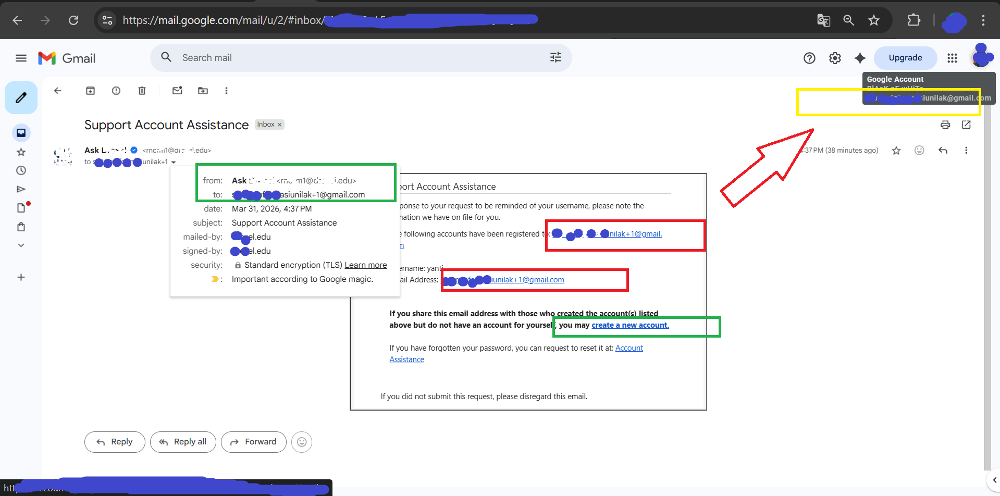

### Eksploitasi Logika Bisnis & Injeksi Karakter pada Sistem Manajemen Dukungan 
###### Web testing: VDP 
###### Date: March 31, 2026
---
#### 1. Pendahuluan
Dalam kegiatan riset keamanan terbaru, saya menemukan kerentanan kritis pada sebuah platform manajemen dukungan universitas terkemuka diluarnegri. Kerentanan ini memungkinkan penyerang untuk melakukan Full Account Takeover (ATO) melalui manipulasi logika bisnis pada modul registrasi .

#### 2. Ringkasan Temuan
Berikut ini adalah Ringkasan singkat:
+ Inkonsistensi Normalisasi Email & Injeksi Null Byte (%00): Kegagalan sistem dalam membedakan identitas akun saat menggunakan alias Gmail dan karakter kontrol.

#### 3. Detail Kerentanan 
**1 Full Account Takeover**

***Akar Masalah:***
+ Sistem pada target-app.edu tidak melakukan normalisasi (canonicalization) email secara konsisten. Sistem memperlakukan variasi alias Gmail (sub-addressing) dan karakter Null Byte sebagai akun unik di database, namun memotongnya saat proses pengiriman email (SMTP).

***Logika yang Cacat:***

+ Database: Menganggap victim@gmail.com dan victim+1%00@gmail.com adalah dua entitas berbeda (registrasi diizinkan).
+ SMTP Server: Membaca string hingga karakter %00, sehingga semua notifikasi dikirim ke kotak masuk utama yang sama.

***Langkah Reproduksi (PoC)***
+ Registrasi Korban: Membuat akun dengan email targetuser@gmail.com.
+ Registrasi Penyerang: Membuat akun baru dengan email targetuser+attacker%00@gmail.com. Sistem menerima ini sebagai akun baru dengan username berbeda.
+ Pemicu Serangan: Penyerang melakukan permintaan Reset Password atau Username Reminder.
+ Eksploitasi: Karena adanya Null Byte, server mengirimkan instruksi kredensial akun kedua langsung ke kotak masuk utama milik korban/penyerang.
+ Hasil: Penyerang dapat mengontrol banyak identitas unik di bawah satu kontrol email utama dan berpotensi membajak sesi jika terjadi tabrakan identitas pada modul reset.

#### 4. Dampak Keamanan (Impact)
+ Account Takeover (ATO): Penyerang dapat mengambil alih akun tanpa interaksi korban.
+ Mass Registration (Sybil Attack): Melewati batasan satu akun per email untuk memanipulasi sistem.

#### 5. Rekomendasi Perbaikan
+ Email Normalization: Implementasikan fungsi untuk menghapus semua karakter setelah tanda + dan karakter kontrol sebelum melakukan pengecekan keunikan di database.

+ Strict Input Validation: Tolak pendaftaran yang mengandung karakter non-printable seperti %00 (Null Byte).

#### 6. Kesimpulan
Kerentanan ini menunjukkan bahwa fitur sederhana seperti alias email dapat menjadi celah keamanan besar jika tidak ditangani dengan logika normalisasi yang tepat di sisi backend.

---
sourcode catatan:[script kode](/Web-Security/TEKNIK-Email_Sub-addressing%20&%20Null%20Byte.md)
Peneliti: Pardiansyah Putra
Tanggal Penemuan: 31 Maret 2026
Target Testing:[Rahasia]